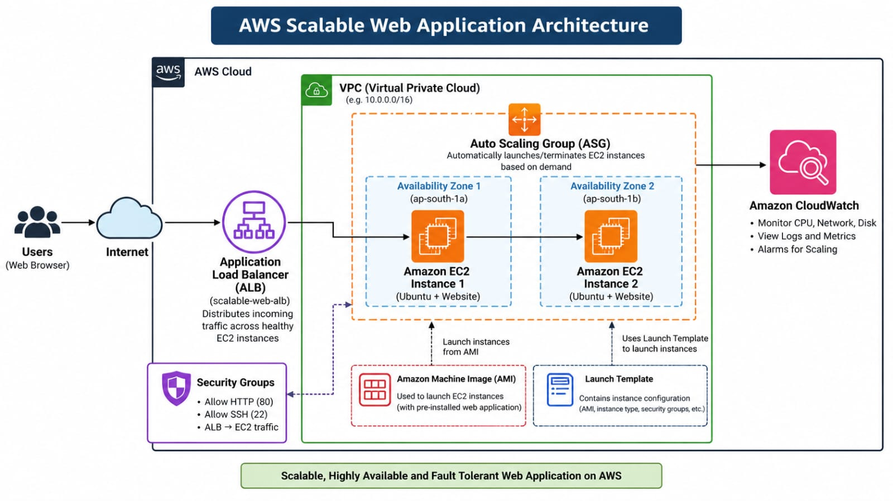

# Scalable Web Application on AWS

## Project Objective
Deploy a scalable web application on AWS using EC2, an Application Load Balancer, Auto Scaling and CloudWatch to distribute traffic and automatically adjust capacity.

## AWS Services Used
- Amazon EC2
- Application Load Balancer (ALB)
- EC2 Auto Scaling
- Elastic Load Balancing Target Groups
- Amazon CloudWatch
- VPC and Security Groups

## Architecture / Workflow
User → Application Load Balancer → Target Group → EC2 Instances managed by Auto Scaling Group

CloudWatch metrics → Auto Scaling Policy → Adjust EC2 capacity

### AWS Architecture Diagram

## Implementation Steps
1. Configured a security group for the web application.
2. Created an EC2 launch template.
3. Configured an Application Load Balancer and target group.
4. Created an Auto Scaling Group using the launch template.
5. Configured target tracking with a 50% CPU utilization target.
6. Verified the website through the ALB DNS address.
7. Monitored EC2 instances and scaling activities.
8. Collected screenshots and terminated resources after testing.

## Testing and Results
- Verified the application was accessible through the load balancer.
- Observed healthy targets in the target group.
- Reviewed scaling activities and EC2 instance counts.
- Checked CloudWatch CPU and network metrics.

## Screenshots
Screenshots of the AWS configuration, scaling activity, monitoring and running website are available in the [screenshots folder](screenshots/).

## Screenshots

The following screenshots demonstrate the AWS infrastructure configuration, Auto Scaling, CloudWatch monitoring, and running web application.

### Running Website

### AWS Configuration

### Auto Scaling Activity

### Auto Scaling Configuration

### Auto Scaling Group Details

### Amazon Machine Image (AMI)

### CloudWatch Monitoring

## Security
- Used security groups to control inbound traffic.
- Do not upload access keys, passwords, private keys or other credentials.
- AWS resources were cleaned up after the demonstration.

## Failure Handling
The load balancer routes requests to healthy registered targets. Auto Scaling can replace unhealthy instances and adjust capacity according to its configuration.

## Production Improvements
- Enable HTTPS using AWS Certificate Manager.
- Use multiple Availability Zones for resilience.
- Apply least-privilege IAM policies.
- Add CloudWatch alarms and access logging.
- Use Infrastructure as Code for repeatable deployments.

## Key Learnings
- Deploying applications on Amazon EC2.
- Distributing traffic using an Application Load Balancer.
- Configuring target groups and Auto Scaling.
- Monitoring application infrastructure with CloudWatch.
- Managing AWS resources and controlling costs.

## Deployment Status
The application was deployed and tested successfully. AWS resources were subsequently terminated or deleted to reduce ongoing charges. The live endpoint is no longer expected to be available.

## Author
Ram Samudre
